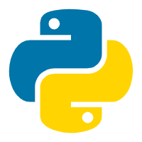

<h1 align="center"> WingSummer.WingHexPy</h1>

WingHexPy

- 开源不易，给个 Star 或者 [捐助](#捐助) 吧

## WingHexPy

### 使用声明

1. 开发本软件目的是让羽云十六进制编辑器具有强大的脚本分析功能，使用 C++ 的 Python 拓展来弥补羽云十六进制编辑器相对于 010 Editor 的不足之处。
2. 本软件仅供学习交流使用，不得私自用于商业用途。如需将本软件某些部分用于商业用途，必须找我购买商业授权，价格私聊。
3. 本人学生，由于本软件是用我的业余时间编写，不能及时修复 Bug 或者提供技术支持，请见谅。
4. 本人非计算机专业，编写程序难免有 Bug ，欢迎提交 PR 。

### 参与贡献

1. 如果您有想参与本软件代码开发递交，请在 pull request 联系我。
2. 本项目支持捐助，如有意愿请到本仓库通过微信或者支付宝的方式进行，一瓶水的价钱足以提高我的维护该项目的热情，感谢大家的支持。
3. 如果您想提交修复或者增进程序的代码，请在 pull request 递交。
4. 任何成功参与代码 Bug 修复以及增进程序功能的同志和 Sponsor ，都会在本仓库 ReadMe 和附属说明文件中体现，您如果是其中之一，本人可以按照您合理的意愿来进行说明。

**加入我们并不意味着就是代码的维护，你可以选择下列一项或多项进行参与：**

1. 代码维护：实现新功能或修复 BUG ，对代码进行维护和升级。
2. 文档编辑：主要是接口文档和教程需要撰写编辑，这很重要。
3. 参与讨论：主要是讨论本项目未来发展和方向等。
4. 编写插件：一起增强该软件的功能。

### 协议

&emsp;&emsp;本插件仓库将采用`AGPL-3.0`协议，不得将该插件代码用于改协议之外的用途。

### issue 前必读

&emsp;&emsp;如果你有任何形式的建议，在提交 issue 之前，请一定要阅读下面的声明，以免浪费我们双方宝贵的时间：

1. 本人不考虑多语言支持，主要是没时间和资金。由于本人是中国人，本人不考虑其他语言使用者。但如果使用其他语言，如果你有语言包，只需要简单的替换文件即可。
2. 本人不会将此插件单独打包为 deb ，会捆绑在“羽云十六进制编辑器”的安装包内供大家使用。
3. 本人不考虑主题 UI 层面的问题，开发本插件与窗体相关一切采用 DTK 原生样式，觉得丑找官方，或者自己写个样式编译加载。

&emsp;&emsp;上面一切的一切，如果你是志同道合的开源贡献者，欢迎 fork 我的仓库进行相应的维护！

### 有关 QCodeEditor

&emsp;&emsp;本软件自带的编写脚本编辑器基于`QCodeEditor`，我对该软件进行的删减和修改增强以适配该插件的功能。如下是原仓库的部分说明，详情请点击 [此链接](https://github.com/Megaxela/QCodeEditor) ：

---

# Qt Code Editor Widget
It's a widget for editing/viewing code.

This project uses a resource named `qcodeeditor_resources.qrc`. The main application
must not use a resource file with the same name.

(It's not a project from a Qt example.)

## Requirements
0. C++11 featured compiler.
0. Qt 5.

## Abilities
1. Auto parentheses.
1. Different highlight rules.
1. Auto indentation.
1. Replace tabs with spaces.
1. GLSL completion rules.
1. GLSL highlight rules.
1. C++ highlight rules.
1. XML highlight rules.
1. JSON highligh rules.
1. Frame selection.
1. Qt Creator styles.

## LICENSE

Library is licensed under the [MIT License](https://opensource.org/licenses/MIT)

Permission is hereby granted, free of charge, to any person obtaining a copy
of this software and associated documentation files (the "Software"), to deal
in the Software without restriction, including without limitation the rights
to use, copy, modify, merge, publish, distribute, sublicense, and/or sell
copies of the Software, and to permit persons to whom the Software is
furnished to do so, subject to the following conditions:

The above copyright notice and this permission notice shall be included in all
copies or substantial portions of the Software.

THE SOFTWARE IS PROVIDED "AS IS", WITHOUT WARRANTY OF ANY KIND, EXPRESS OR
IMPLIED, INCLUDING BUT NOT LIMITED TO THE WARRANTIES OF MERCHANTABILITY,
FITNESS FOR A PARTICULAR PURPOSE AND NONINFRINGEMENT. IN NO EVENT SHALL THE
AUTHORS OR COPYRIGHT HOLDERS BE LIABLE FOR ANY CLAIM, DAMAGES OR OTHER
LIABILITY, WHETHER IN AN ACTION OF CONTRACT, TORT OR OTHERWISE, ARISING FROM,
OUT OF OR IN CONNECTION WITH THE SOFTWARE OR THE USE OR OTHER DEALINGS IN THE
SOFTWARE.

---

### 有关 PythonQt

&emsp;&emsp;所有的 QT C++ 代码与 Python 脚本进行交互基础支持库，如果没有该框架，就不会有该插件的出现。该库遵守`LGPL`协议，如下是原仓库的部分说明，详情请点击 [此链接](https://github.com/MeVisLab/pythonqt) ：

---

PythonQt is a dynamic Python binding for Qt. It offers an easy way to embed the Python scripting language into your Qt applications.

Documentation
API documentation is available at: https://mevislab.github.io/pythonqt

Licensing
PythonQt is distributed under the LGPL 2.1 license.

---

&emsp;&emsp;鉴于 Linux 的动态库调用没有 Windows 方便之处，所以我使用了静态链接，按照协议必须开源修改后的代码。我把该库的`PythonQtScriptingConsole`单独出来进行编译，所有修改的代码都在头文件（减少警告）和代码文件`PythonQtScriptingConsole.hpp`和`PythonQtScriptingConsole.cpp`中。也就是说，所有的修改部分均在我的仓库文件当中。

## 效果图

WingHexPy

## 捐助

**
您的每一份支持都将是本项目推进的强大动力，十分感谢您的支持
**

感谢支持

感谢支持

## 有关仓库

* GitLink ： https://www.gitlink.org.cn/wingsummer/WingHexPy
* Gitea ： https://code.gitlink.org.cn/wingsummer/WingHexPy
* Gitee ： https://gitee.com/wingsummer/wing-hex-py

## WIKI

> 插件完成后建设
